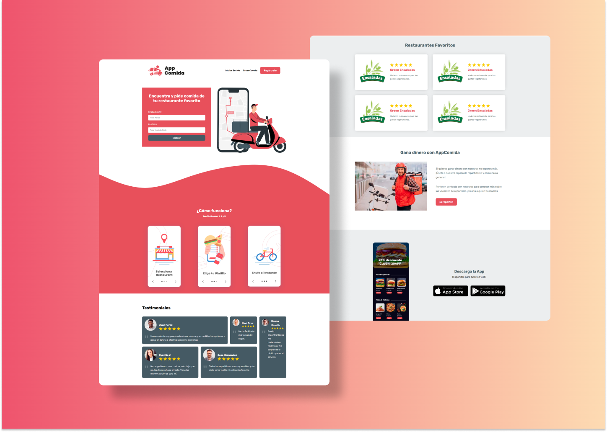

<h1>DeliveryApp &mdash; Landing Page 🛵</h1>



<p>This responsive landing page is about a startup called "AppComida" that uses a mobile app to order food. It has seven sections with information related to the application, some animations and a nice design.</p>

<p>DeliveryApp is available on: </p>

```
https://deliveryappsrsn.netlify.app/
```

<p>If you download this app, install the development dependencies with: </p>

```
npm install
```

<p>To run gulp default tasks, just excute:</p>

```
gulp
```

<p>Gulp default tasks are: </p>
<p>&mdash; compile: to compile scss code to css code</p> 
<p>&mdash; attention: to watch changes in scss files</p> 

<br>

<h2>Tools and Technologies</h2>

<ul>
<li>
HTML5
</li>
<li>
CSS3
</li>
<li>
Gulp
</li>
<li>
Preprocessor CSS &mdash; SASS
</li>
<li>
BEM methodology
</li>
</ul>
<br>

## UI Considerations

Colors: 

 * Primary: #e8505b
 * Secondary: #455a64
 * Gray: #eceeef
 * Black: #000000
 * White: #ffffff

Breaking Points:

This app was developed following "mobile first" principle.

 * Phone: 480px
 * Tablet: 768px
 * Desktop: 1024px